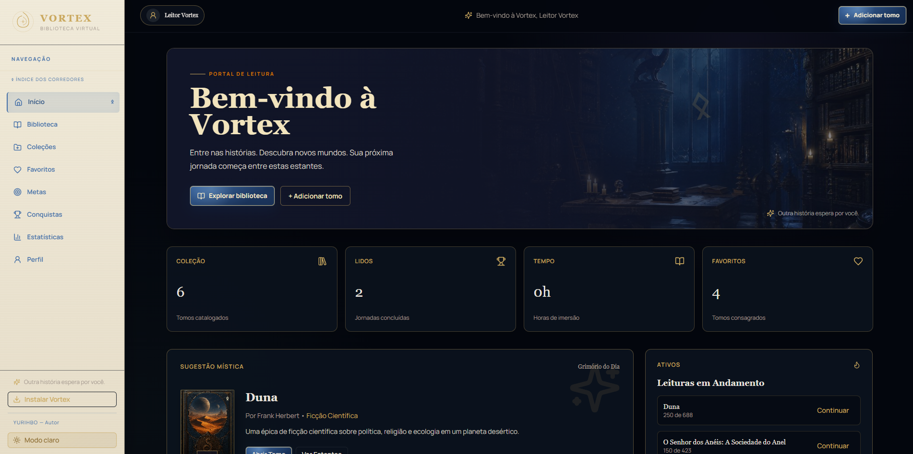
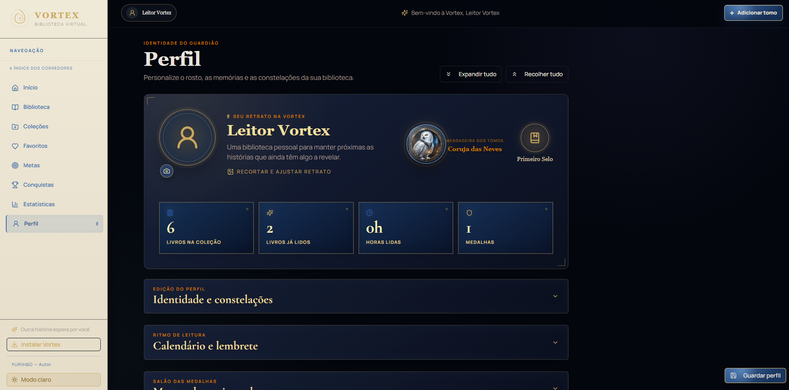
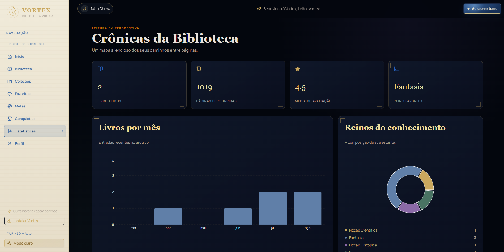

<div align="center">


# VORTEX — Biblioteca Virtual

### ✦ Transforme sua estante em uma jornada.

Uma biblioteca digital pessoal inspirada em **fantasia medieval, bibliotecas arcanas e mundos de fantasia**, criada para organizar livros, acompanhar leituras e transformar cada página em parte de uma jornada.

<br>

[](https://github.com/Yurihbo/VORTEX)
[](https://react.dev/)
[](https://www.typescriptlang.org/)
[](https://vite.dev/)
[](https://tailwindcss.com/)
[](https://developer.mozilla.org/en-US/docs/Web/Progressive_web_apps)
[](LICENSE)

<br>

**[📚 Explorar o projeto](https://github.com/Yurihbo/VORTEX)**

</div>

---

## ✦ Sobre o VORTEX

O **VORTEX** é uma biblioteca virtual pessoal desenvolvida para tornar o acompanhamento de leituras mais organizado, visual e envolvente.

A proposta não é apenas catalogar livros. A aplicação transforma a biblioteca em um pequeno **universo literário**, no qual cada livro pode representar uma jornada, cada meta uma conquista e cada estatística um registro da evolução do leitor.

A interface foi projetada com uma identidade visual inspirada em **bibliotecas antigas, fantasia medieval e grimórios**, combinando tons escuros, dourado, azul profundo, elementos ornamentais e tipografia editorial.

---

## 🖼️ Visão geral

<div align="center">



<br><br>



<br><br>



</div>

---

## 🏛️ O que existe dentro da biblioteca?

### 📖 Biblioteca

O coração do VORTEX.

- Catálogo de livros
- Busca e filtros
- Organização por status
- Ordenação da coleção
- Diferentes formas de visualização
- Capas e informações dos livros
- Acesso ao detalhamento de cada obra

### 🔮 Grimório do livro

Cada tomo possui uma área própria para acompanhar a jornada de leitura.

- Progresso por páginas
- Status de leitura
- Favoritos
- Notas pessoais
- Fragmentos marcantes
- Informações detalhadas da obra

### ✦ Dashboard

Uma visão geral da biblioteca logo na entrada.

- Total de livros catalogados
- Livros concluídos
- Horas de leitura
- Favoritos
- Leituras em andamento
- Sugestões de leitura
- Panorama da coleção

### 🗺️ Coleções

Organize os livros em grupos e crie diferentes caminhos dentro da sua biblioteca.

### ❤️ Favoritos

Mantenha seus tomos mais importantes sempre por perto.

### 🎯 Metas e desafios

Transforme a leitura em uma jornada contínua.

- Metas de leitura
- Acompanhamento de progresso
- Desafios
- Contador de constância
- Evolução do leitor

### 🏆 Conquistas

Marcos desbloqueados conforme o leitor avança em sua jornada.

### 📊 Estatísticas

Uma visão analítica da sua biblioteca.

- Livros lidos
- Páginas percorridas
- Média de avaliação
- Livros por mês
- Distribuição por gênero
- Reinos do conhecimento
- Evolução da leitura

### 👤 Perfil

Um espaço para personalizar a identidade do leitor.

- Retrato do leitor
- Identidade da biblioteca
- Conquistas
- Estatísticas pessoais
- Medalhas
- Preferências
- Configurações de leitura

### 💾 Dados e backup

O projeto também contempla gerenciamento dos dados do leitor, incluindo exportação e importação de informações em JSON.

---

## 📱 PWA — sua biblioteca em qualquer lugar

O VORTEX foi estruturado como uma **Progressive Web App**.

Isso permite que a biblioteca seja utilizada como uma experiência semelhante a um aplicativo, com suporte à instalação em dispositivos compatíveis.

O projeto possui:

- `manifest.json`
- Service Worker
- Ícones próprios
- Modo standalone
- Cache para experiência offline
- Interface adaptada para diferentes tamanhos de tela
- Orientação mobile
- Idioma `pt-BR`

---

## 🧩 Stack utilizada

### Front-end

| Tecnologia | Utilização |
|---|---|
| **React 19** | Construção da interface |
| **TypeScript** | Tipagem e segurança do código |
| **Vite 7** | Desenvolvimento e build |
| **Tailwind CSS 4** | Estilização |
| **Radix UI** | Componentes acessíveis |
| **Lucide React** | Ícones |
| **Framer Motion** | Animações e transições |
| **Recharts** | Gráficos e estatísticas |
| **Wouter** | Roteamento |
| **React Hook Form** | Formulários |
| **Zod** | Validação de dados |
| **Axios** | Comunicação HTTP |

### Back-end

- **Node.js**
- **Express**
- **TypeScript**
- **esbuild**

### Ferramentas

- **pnpm**
- **Prettier**
- **Vitest**
- **ESLint / TypeScript tooling**
- **Vite**

---

## 🏗️ Arquitetura

O projeto possui uma organização separando a aplicação em camadas:

```text
VORTEX/
│
├── client/
│   ├── public/
│   │   ├── assets/
│   │   ├── companions/
│   │   ├── manifest.json
│   │   ├── sw.js
│   │   └── vortex-icon.svg
│   │
│   └── src/
│       ├── components/
│       ├── contexts/
│       ├── hooks/
│       ├── lib/
│       ├── pages/
│       ├── services/
│       ├── types/
│       ├── App.tsx
│       ├── const.ts
│       ├── index.css
│       └── main.tsx
│
├── server/
│   └── index.ts
│
├── shared/
│   └── const.ts
│
├── patches/
├── .github/
├── package.json
├── pnpm-lock.yaml
└── README.md
```

A camada de páginas contém módulos como:

```text
Dashboard
Home
Library
BookDetail
AddBook
Collections
Favorites
Goals
Achievements
Statistics
Profile
```

---

## 🚀 Executando localmente

### Pré-requisitos

Antes de começar, tenha instalado:

- **Node.js 20+**
- **pnpm 10+**
- Git

### 1. Clone o repositório

```bash
git clone https://github.com/Yurihbo/VORTEX.git
cd VORTEX
```

### 2. Instale as dependências

```bash
pnpm install
```

### 3. Inicie o ambiente de desenvolvimento

```bash
pnpm dev
```

Depois, abra o endereço exibido pelo Vite no terminal.

> A configuração atual do projeto utiliza Vite com host habilitado, permitindo acesso pelo ambiente local e pela rede quando necessário.

---

## 📦 Scripts disponíveis

```bash
# Desenvolvimento
pnpm dev

# Build de produção
pnpm build

# Pré-visualização do build
pnpm preview

# Verificação TypeScript
pnpm check

# Formatação
pnpm format

# Execução da versão de produção
pnpm start
```

---

## 🎨 Identidade visual

O VORTEX foi pensado para fugir do visual tradicional de gerenciadores de livros.

A direção artística combina:

- 🌑 Azul-marinho e fundos escuros
- ✦ Dourado como cor de destaque
- 📜 Tons de pergaminho
- 🏰 Referências a bibliotecas medievais
- 🔮 Elementos de fantasia e magia
- 📖 Tipografia editorial
- 🗝️ Ícones e detalhes ornamentais
- 🐉 Atmosfera de mundos fantásticos

A intenção é que o usuário não sinta que está apenas utilizando um sistema de cadastro, mas que está **entrando em sua própria biblioteca**.

---

## 📐 Experiência responsiva

A interface foi planejada para diferentes formatos:

```text
┌───────────────────────────────────────────┐
│                   DESKTOP                 │
│  Sidebar  │          Biblioteca            │
│           │                               │
└───────────────────────────────────────────┘

┌─────────────────────────────┐
│           TABLET            │
│     Biblioteca adaptada     │
│                             │
└─────────────────────────────┘

┌───────────────────┐
│      MOBILE       │
│   VORTEX PWA      │
│                   │
└───────────────────┘
```

---

## 🧠 Conceito

> **"Toda biblioteca guarda histórias. O VORTEX guarda a jornada de quem as lê."**

A ideia por trás do projeto é transformar dados de leitura em uma experiência mais pessoal.

Em vez de simplesmente responder:

> "Quantos livros eu tenho?"

o VORTEX busca responder:

> "Qual foi a jornada que construí através deles?"

---

## 🛠️ Estado do projeto

O VORTEX está em **desenvolvimento contínuo**.

A arquitetura foi construída pensando na expansão da biblioteca, permitindo adicionar novas funcionalidades, componentes e experiências sem abandonar a identidade visual original.

### Próximos caminhos possíveis

- [ ] Sistema de temas ainda mais personalizável
- [ ] Mais conquistas e desafios
- [ ] Novas visualizações estatísticas
- [ ] Melhorias na experiência mobile
- [ ] Evolução do sistema de coleções
- [ ] Novas interações no perfil
- [ ] Expansão dos elementos de gamificação
- [ ] Novos recursos para acompanhamento de leitura

---

## 🧪 Qualidade e desenvolvimento

O projeto utiliza ferramentas modernas para manter o código organizado e verificável:

- TypeScript para tipagem
- Prettier para formatação
- Verificação com TypeScript
- Vitest para testes
- Componentização em React
- Separação entre client, server e shared
- Componentes reutilizáveis
- Contextos e hooks específicos para comportamento compartilhado

---

## 📂 Organização do código

A estrutura do VORTEX foi pensada para separar responsabilidades.

**`client/src/pages`**  
Contém as páginas principais da aplicação.

**`client/src/components`**  
Componentes reutilizáveis, como layout, capas de livros, logo e elementos de interface.

**`client/src/contexts`**  
Contextos globais, incluindo o gerenciamento de tema.

**`client/src/hooks`**  
Hooks personalizados para comportamentos reutilizáveis.

**`client/src/services`**  
Camada destinada aos serviços e comunicação da aplicação.

**`client/src/types`**  
Definições de tipos compartilhados no front-end.

**`server`**  
Estrutura responsável pelo servidor Express.

**`shared`**  
Constantes e elementos compartilhados entre as camadas.

---

## 🌟 Destaques do projeto

| Área | Destaque |
|---|---|
| 🎨 Design | Identidade visual própria de fantasia medieval |
| 📚 Biblioteca | Catálogo e gerenciamento de livros |
| 📊 Dados | Estatísticas e acompanhamento da leitura |
| 🎯 Gamificação | Metas, desafios e conquistas |
| 💾 Backup | Importação e exportação de dados |
| 📱 PWA | Experiência instalável |
| 🌙 Interface | Tema escuro inspirado em bibliotecas arcanas |
| 📐 Responsividade | Desktop, tablet e mobile |
| 🧩 Arquitetura | React + TypeScript + Node/Express |

---

## 🔐 Privacidade

O VORTEX foi concebido como uma biblioteca pessoal.

Os dados de leitura e informações do usuário devem ser tratados como dados privados, especialmente quando utilizados localmente ou em uma instalação pessoal.

> Antes de disponibilizar uma instância pública, configure corretamente autenticação, armazenamento e políticas de segurança adequadas ao ambiente de produção.

---

## 🤝 Contribuição

Sugestões, melhorias e ideias são bem-vindas.

Se quiser contribuir:

```bash
git checkout -b feature/minha-melhoria
```

Faça suas alterações, valide o projeto e envie um Pull Request.

---

## 📜 Licença

Este projeto está distribuído sob a licença **MIT**.

Consulte o arquivo [`LICENSE`](LICENSE) para mais informações.

---

<div align="center">

### ✦ VORTEX

**Uma biblioteca. Milhares de histórias. Uma jornada.**

<br>

Desenvolvido por **Yurihbo**

[GitHub](https://github.com/Yurihbo) · [Repositório](https://github.com/Yurihbo/VORTEX)

<br><br>


</div>
